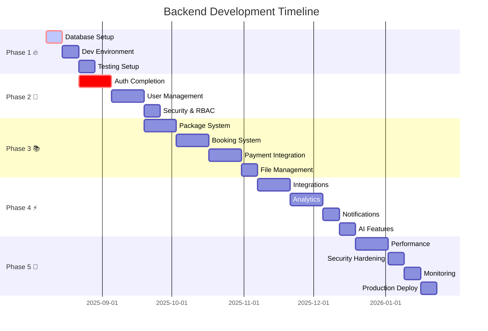

# 🚀 Backend Development Roadmap - Student Platform

## 📋 Indice
1. [Panoramica Generale](#panoramica-generale)
2. [Fase 1: Core Infrastructure & Setup](#fase-1-core-infrastructure--setup)
3. [Fase 2: Authentication & User Management](#fase-2-authentication--user-management)
4. [Fase 3: Business Logic & Core Features](#fase-3-business-logic--core-features)
5. [Fase 4: Advanced Features & Integrations](#fase-4-advanced-features--integrations)
6. [Fase 5: Performance & Production Ready](#fase-5-performance--production-ready)
7. [Timeline & Priorità](#timeline--priorità)

---

## 🎯 Panoramica Generale

### **Obiettivo Principale**
Completare e ottimizzare il backend FastAPI per supportare tutte le funzionalità della Student Platform, garantendo scalabilità, sicurezza e performance di livello produttivo.

### **Principi Guida**
- 🔒 **Security First**: Autenticazione robusta e protezione dati
- ⚡ **Performance**: API veloci e database ottimizzato
- 📊 **Data Integrity**: Validazione completa e transazioni sicure
- 🔧 **Maintainability**: Codice pulito, testato e documentato
- 🚀 **Scalability**: Architettura che cresce con il business

### **Situazione Attuale** *(Analisi del 7 Agosto 2025)*
- ✅ **Struttura Base**: FastAPI app configurata con moduli organizzati
- ✅ **Modelli Database**: User, Student, Tutor, Booking, Package models definiti
- ✅ **Auth Structure**: Sistema JWT implementato con routes basic
- ⚠️ **Da Completare**: Database setup, testing, validazioni, API documentation
- 🚫 **Mancante**: Migrations, production config, integrations, monitoring

### **Progressi Attuali** *(Aggiornato: 8 Agosto 2025)*
- ✅ **Architettura Modulare**: App ben strutturata in moduli logici
- ✅ **Modelli Completi**: Database schema completo e relazioni definite
- ✅ **Server Avvio**: FastAPI server funziona correttamente (http://localhost:8000)
- ✅ **Import Fixes**: Risolti conflitti import e modelli duplicati User
- ✅ **Database Setup**: PostgreSQL inizializzato con 11 tabelle create
- ✅ **Migrations**: Alembic configurato e prima migration applicata (3367268e98a1)
- ⚠️ **API Endpoints**: Definiti ma necessitano testing e validazione
- 🚫 **Testing**: Test suite configurata ma non implementata
- 🚫 **Documentation**: API docs basic, manca documentazione tecnica

---

## 🏗️ Fase 1: Core Infrastructure & Setup
**Durata Stimata: 1-2 settimane** | **Status: 🔄 PRIORITÀ MASSIMA**

### 🗄️ **1.1 Database Setup & Migrations** ✅ **COMPLETATO**
**Problema Attuale:** ~~Database non inizializzato, nessuna migration presente~~
**Soluzione:** ✅ Setup completo PostgreSQL + Alembic migrations

**Tasks Completati:**
```bash
✅ PostgreSQL container attivo su porta 5432
✅ Database 'tutoring' creato e accessibile
✅ Alembic configurato con script_location = migrations
✅ Initial migration generata con 11 tabelle
✅ Migration applicata: version 3367268e98a1
✅ Tutte le tabelle create: users, students, tutors, bookings, packages, slots, etc.
```
# Database Setup Checklist
├── ✅ PostgreSQL connection configurata (.env)
├── ⏸️ Database creazione e test connessione
├── ⏸️ Alembic migrations iniziali
├── ⏸️ Schema validation e constraints
├── ⏸️ Seed data per development
└── ⏸️ Backup/restore procedures
```

**Deliverables:**
- Database funzionante con tutte le tabelle
- Migration scripts per tutti i modelli
- Seed data per testing
- Database documentation

### 🔧 **1.2 Development Environment** ⚠️ **IMPORTANTE**
**Tasks:**
```python
# Dev Environment Checklist
├── ⏸️ Docker setup completo (PostgreSQL + Redis)
├── ⏸️ Virtual environment documentation
├── ⏸️ IDE configuration (VS Code settings)
├── ⏸️ Hot reload configuration
├── ⏸️ Logging system setup
└── ⏸️ Environment variables validation
```

### 🧪 **1.3 Testing Infrastructure** 🔄 **MEDIUM PRIORITY**
**Stato Attuale:** Test suite configurata ma vuota
**Target:** Test automation completo

**Testing Strategy:**
```python
# Testing Framework Setup
├── ⏸️ Pytest configuration completa
├── ⏸️ Test database setup
├── ⏸️ Factory pattern per test data
├── ⏸️ Authentication testing utilities
├── ⏸️ API integration testing framework
└── ⏸️ Coverage reporting
```

---

## 🔐 Fase 2: Authentication & User Management
**Durata Stimata: 2-3 settimane** | **Status: ⚠️ PARZIALMENTE IMPLEMENTATO**

### 🔑 **2.1 Authentication System** ⚠️ **DA COMPLETARE**
**Stato Attuale:** JWT implementato ma non testato
**Target:** Sistema auth production-ready

**Critical Tasks:**
```python
# Auth System Completion
├── ⚠️ JWT token validation completa
├── ⏸️ Password hashing security audit
├── ⏸️ Token refresh mechanism testing
├── ⏸️ Session management implementation
├── ⏸️ Rate limiting per auth endpoints
├── ⏸️ Account lockout mechanism
└── ⏸️ Password complexity validation
```

**Security Features da Implementare:**
- 🔒 **Multi-factor Authentication** (opzionale)
- 🔒 **OAuth2 Google Integration** 
- 🔒 **Password Reset Flow** (email)
- 🔒 **Account Verification** (email)
- 🔒 **Suspicious Activity Detection**

### 👥 **2.2 User Management APIs** ⚠️ **DA TESTARE**
**Stato:** Models definiti, APIs da validare

**User APIs da Completare:**
```python
# User Management Completion
├── ⚠️ Student registration flow
├── ⚠️ Tutor registration + verification
├── ⏸️ Profile management APIs
├── ⏸️ Role-based permissions system
├── ⏸️ User search & filtering
├── ⏸️ Admin user management
└── ⏸️ User analytics tracking
```

### 🛡️ **2.3 Security & Permissions** 🔄 **IMPLEMENTATION NEEDED**
**Target:** Role-based access control completo

**RBAC Implementation:**
```python
# Permission System
├── ⏸️ Role definitions (Student, Tutor, Admin)
├── ⏸️ Resource-based permissions
├── ⏸️ API endpoint protection
├── ⏸️ Data access control
├── ⏸️ Audit logging
└── ⏸️ Security headers middleware
```

---

## 📚 Fase 3: Business Logic & Core Features
**Durata Stimata: 3-4 settimane** | **Status: ⏸️ PIANIFICATO**

### 📦 **3.1 Package Management System**
**Stato:** Models definiti, logica business da implementare

**Package Features:**
```python
# Package System Implementation
├── ⏸️ Package creation by tutors
├── ⏸️ Package discovery & search
├── ⏸️ Package pricing & discounts
├── ⏸️ Package reviews & ratings
├── ⏸️ Package analytics
├── ⏸️ Package lifecycle management
└── ⏸️ Package recommendation engine
```

### 📅 **3.2 Booking System**
**Stato:** Basic models, sistema complesso da implementare

**Booking Features Critical:**
```python
# Booking System Core
├── ⏸️ Real-time availability checking
├── ⏸️ Conflict detection & resolution
├── ⏸️ Booking confirmation flow
├── ⏸️ Cancellation policies
├── ⏸️ Reschedule functionality
├── ⏸️ Booking notifications
├── ⏸️ Calendar integration (Google)
└── ⏸️ Booking analytics & reporting
```

**Advanced Booking Features:**
- 🔄 **Recurring Bookings** - Lezioni settimanali
- 📱 **Real-time Notifications** - WebSocket/Push
- 🗓️ **Smart Scheduling** - AI-based suggestions
- ⏰ **Time Zone Handling** - Multi-timezone support

### 💰 **3.3 Payment System Integration**
**Stato:** Non implementato
**Priority:** High per monetization

**Payment Features:**
```python
# Payment System
├── ⏸️ Stripe integration setup
├── ⏸️ Payment intent creation
├── ⏸️ Subscription management
├── ⏸️ Refund processing
├── ⏸️ Payment history tracking
├── ⏸️ Invoice generation
├── ⏸️ Tax calculation
└── ⏸️ Payout management (tutors)
```

### 📁 **3.4 File Management System**
**Stato:** Basic structure, da espandere

**File Features:**
```python
# File Management
├── ⏸️ Secure file upload
├── ⏸️ File organization & folders
├── ⏸️ Access control per files
├── ⏸️ File sharing between users
├── ⏸️ File versioning
├── ⏸️ Bulk operations
├── ⏸️ File analytics
└── ⏸️ Cloud storage integration
```

---

## ⚡ Fase 4: Advanced Features & Integrations
**Durata Stimata: 3-4 settimane** | **Status: ⏸️ FUTURO**

### 🔗 **4.1 External Integrations**

**Google Workspace Integration:**
```python
# Google APIs
├── ⏸️ Google Calendar sync
├── ⏸️ Google Meet integration
├── ⏸️ Google Drive file sharing
├── ⏸️ Gmail notifications
└── ⏸️ Google OAuth2 SSO
```

**Communication Integrations:**
```python
# Communication Tools
├── ⏸️ Email service (SendGrid/SES)
├── ⏸️ SMS notifications (Twilio)
├── ⏸️ WhatsApp Business API
├── ⏸️ Telegram bot integration
└── ⏸️ Video conferencing (Zoom/Meet)
```

### 📊 **4.2 Analytics & Reporting**
**Business Intelligence Features:**

```python
# Analytics Engine
├── ⏸️ User behavior tracking
├── ⏸️ Booking conversion metrics
├── ⏸️ Revenue analytics
├── ⏸️ Tutor performance metrics
├── ⏸️ Student progress tracking
├── ⏸️ Platform usage statistics
├── ⏸️ Custom report generation
└── ⏸️ Data export capabilities
```

### 🔔 **4.3 Notification System**
**Multi-channel Notifications:**

```python
# Notification Engine
├── ⏸️ Email notifications
├── ⏸️ Push notifications
├── ⏸️ SMS alerts
├── ⏸️ In-app notifications
├── ⏸️ Notification preferences
├── ⏸️ Notification templates
├── ⏸️ Delivery tracking
└── ⏸️ Notification analytics
```

### 🤖 **4.4 Automation & AI Features**
**Smart Platform Features:**

```python
# AI & Automation
├── ⏸️ Smart tutor matching
├── ⏸️ Automated scheduling suggestions
├── ⏸️ Content recommendation engine
├── ⏸️ Fraud detection
├── ⏸️ Performance analytics AI
├── ⏸️ Chatbot support
├── ⏸️ Automated email sequences
└── ⏸️ Predictive analytics
```

---

## 🚀 Fase 5: Performance & Production Ready
**Durata Stimata: 2-3 settimane** | **Status: ⏸️ FUTURO**

### ⚡ **5.1 Performance Optimization**

**Database Performance:**
```sql
# Database Optimization
├── ⏸️ Query optimization & indexing
├── ⏸️ Connection pooling
├── ⏸️ Database monitoring
├── ⏸️ Slow query analysis
├── ⏸️ Read replicas setup
└── ⏸️ Caching strategy (Redis)
```

**API Performance:**
```python
# API Optimization
├── ⏸️ Response caching
├── ⏸️ Pagination implementation
├── ⏸️ Rate limiting
├── ⏸️ Request/response compression
├── ⏸️ Async operations optimization
└── ⏸️ Load testing
```

### 🔒 **5.2 Security Hardening**

**Production Security:**
```python
# Security Checklist
├── ⏸️ SQL injection prevention
├── ⏸️ XSS protection
├── ⏸️ CSRF protection
├── ⏸️ Input validation & sanitization
├── ⏸️ Security headers
├── ⏸️ API versioning
├── ⏸️ Dependency vulnerability scanning
└── ⏸️ Security monitoring
```

### 📊 **5.3 Monitoring & Observability**

**Production Monitoring:**
```python
# Monitoring Setup
├── ⏸️ Application logging
├── ⏸️ Error tracking (Sentry)
├── ⏸️ Performance monitoring (APM)
├── ⏸️ Health checks
├── ⏸️ Metrics collection
├── ⏸️ Alerting system
├── ⏸️ Dashboard setup
└── ⏸️ Uptime monitoring
```

### 🚢 **5.4 Deployment & DevOps**

**Production Deployment:**
```yaml
# DevOps Pipeline
├── ⏸️ Docker containerization
├── ⏸️ CI/CD pipeline (GitHub Actions)
├── ⏸️ Environment management
├── ⏸️ Database migrations automation
├── ⏸️ Blue-green deployment
├── ⏸️ Backup automation
├── ⏸️ Rollback procedures
└── ⏸️ Infrastructure as Code
```

---

## ⏰ Timeline & Priorità

### 🎯 **Sprint Planning (2-week sprints)**



### 🔥 **Priorità Critica - Immediate Actions**

| Task | Business Impact | Technical Risk | Effort | Priority | ETA |
|------|----------------|----------------|---------|----------|-----|
| **Database Setup** | 🔥🔥🔥🔥🔥 | 🚨🚨🚨🚨🚨 | 🛠️🛠️ | **CRITICO** | 3-5 giorni |
| **Auth Testing** | 🔥🔥🔥🔥🔥 | 🚨🚨🚨🚨 | 🛠️🛠️🛠️ | **CRITICO** | 1 settimana |
| **User Registration** | 🔥🔥🔥🔥 | 🚨🚨🚨 | 🛠️🛠️ | **ALTO** | 1 settimana |
| **Booking Core** | 🔥🔥🔥🔥 | 🚨🚨🚨 | 🛠️🛠️🛠️🛠️ | **ALTO** | 2 settimane |
| **Payment System** | 🔥🔥🔥 | 🚨🚨 | 🛠️🛠️🛠️ | **MEDIO** | 2 settimane |

### 📊 **Success Metrics**

**Technical KPIs:**
```python
# Backend Success Metrics
performance_targets = {
    "api_response_time": "<200ms (95th percentile)",
    "database_query_time": "<50ms average",
    "error_rate": "<0.1%",
    "uptime": ">99.9%",
    "test_coverage": ">90%",
    "api_documentation": "100% coverage"
}

business_kpis = {
    "user_registration_success": ">95%",
    "booking_completion_rate": ">90%",
    "payment_success_rate": ">98%",
    "api_adoption_rate": "Track frontend integration",
    "security_incidents": "0 critical incidents"
}
```

---

## 🎯 Immediate Action Plan

### **Week 1 Priority (8-15 Agosto 2025)**
1. ✅ **Database Setup**
   - PostgreSQL connection test
   - Alembic migrations creation
   - Initial schema deployment
   - Basic CRUD operations test

2. ✅ **Authentication Validation**
   - JWT token flow testing
   - Password security audit
   - Registration/login API testing
   - Frontend integration test

### **Week 2-3 Priority (16-29 Agosto 2025)**
1. 🔄 **User Management APIs**
   - Student/Tutor registration completion
   - Profile management APIs
   - Role-based access control
   - API documentation update

2. 🔄 **Core Business Logic**
   - Package system implementation
   - Basic booking flow
   - File upload functionality

### **Critical Dependencies**
- ⚠️ **Frontend Authentication**: Dipende da backend auth completion
- ⚠️ **Database**: Prerequisito per tutte le features
- ⚠️ **Testing**: Necessario per quality assurance

---

## 📋 Next Steps

### **Immediate (Oggi - 7 Agosto 2025)**
1. **Database Setup** - Inizializzare PostgreSQL e migrations
2. **Authentication Test** - Verificare JWT implementation
3. **Environment Validation** - Testare tutte le configurazioni

### **This Week (8-15 Agosto)**
1. **Complete Database Schema** - Tutte le tabelle funzionanti
2. **Test Authentication Flow** - Registration + Login working
3. **Frontend Integration** - Collegare backend al frontend

### **Next Sprint (16-29 Agosto)**
1. **Core APIs** - User management + Packages
2. **Business Logic** - Booking system core
3. **Integration Testing** - End-to-end testing

---

**🚀 Il backend ha una solida foundation ma necessita di completamento immediato per supportare il frontend. La priorità assoluta è database + authentication per permettere l'integrazione frontend-backend.**

*Ready to start with Database Setup? 🗄️*
