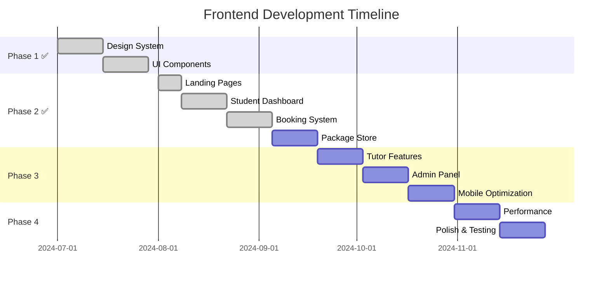

# 🚀 Frontend Development Roadmap - Student Platform

## 📋 Indice
1. [Panoramica Generale](#panoramica-generale)
2. [Fase 1: Design System & Foundation](#fase-1-design-system--foundation)
3. [Fase 2: Core User Experience](#fase-2-core-user-experience)
4. [Fase 3: Advanced Features](#fase-3-advanced-features)
5. [Fase 4: Performance & Polish](#fase-4-performance--polish)
6. [Fase 5: Future Enhancements](#fase-5-future-enhancements)
7. [Timeline & Priorità](#timeline--priorità)

---

## 🎯 Panoramica Generale

### **Obiettivo Principale**
Trasformare la Student Platform da prototipo funzionale a **applicazione web moderna**, user-friendly e scalabile che supporti efficacemente l'ecosistema educativo studenti-tutor-admin.

### **Principi Guida**
- ✨ **User-Centric Design**: Ogni decisione basata su esigenze utente reali
- 📱 **Mobile-First**: Design responsive e touch-friendly
- ⚡ **Performance**: Caricamenti rapidi e interazioni fluide
- ♿ **Accessibility**: Inclusivo per tutti gli utenti
- 🔄 **Scalability**: Architettura che cresce con il business

### **Situazione Attuale**
- ✅ **Completato**: Backend API, Auth system, routing base, Design System, Homepage moderna
- ⚠️ **Da Migliorare**: Dashboard studenti, booking system, funzionalità avanzate
- 🚫 **Mancante**: Mobile experience, features business-critical avanzate

### **Progressi Recenti** *(Aggiornato: 7 Agosto 2025)*
- ✅ **FASE 1 COMPLETATA**: Design System & Foundation (100%)
- ✅ **FASE 2.1 COMPLETATA**: Homepage & Landing Pages (100%)
- ✅ **FASE 2.2 COMPLETATA**: Student Dashboard Redesign (100%)
- ✅ **FASE 2.3 COMPLETATA**: Booking System Avanzato (100%)
- ✅ **FASE 2.4 COMPLETATA**: Package Store & Discovery (100%)
- ✅ **FASE 3.1 COMPLETATA**: Tutor Experience Enhancement (100%)
- ✅ **FASE 3.2 COMPLETATA**: Admin Panel Professionale (100%)

---

## 📦 Fase 1: Design System & Foundation ✅ **COMPLETATA**
**Durata: 2-3 settimane** | **Status: ✅ COMPLETATO (7 Agosto 2025)**

### 🎨 **1.1 Design System Setup** ✅ **COMPLETATO**

**✅ Deliverables Implementati:**
```markdown
📁 src/components/ui/ ✅ COMPLETATO
├── Button.tsx           ✅ Varianti: primary, secondary, outline, ghost, danger
├── Card.tsx             ✅ Container base con shadow e padding consistenti
├── Badge.tsx            ✅ Status indicators (attivo, scaduto, pending)
├── Input.tsx            ✅ Form inputs con validation states
├── Modal.tsx            ⏸️ Da implementare (Fase 3)
├── Toast.tsx            ⏸️ Da implementare (Fase 3)
├── Spinner.tsx          ⏸️ Da implementare (Fase 3)
└── Typography.tsx       ✅ Gestito tramite globals.css
```

**✅ Configurazione Styling Completata:**
```css
/* Design tokens implementati in globals.css */
:root {
  /* Colors - Primary Palette ✅ */
  --primary-50: #eff6ff;
  --primary-500: #3b82f6;
  --primary-900: #1e3a8a;
  
  /* Status Colors ✅ */
  --success-500: #10b981;
  --warning-500: #f59e0b;
  --error-500: #ef4444;
  
  /* Typography Scale ✅ */
  /* Spacing Scale ✅ */
}
```

### 🏗️ **1.2 Layout System** ✅ **COMPLETATO**
**✅ Componenti Implementati:**
- `Header.tsx` ✅ Header globale con autenticazione e navigazione
- `Footer.tsx` ✅ Footer completo con newsletter e link organizzati
- Layout responsivo ✅ Mobile-first approach implementato
- Design tokens ✅ Sistema di colori e spacing coerente

**✅ Risultati Ottenuti:**
- ✅ Struttura consistente per tutte le pagine
- ✅ Navigation UX migliorata
- ✅ Codice riutilizzabile e modulare

---

## 👨‍🎓 Fase 2: Core User Experience
**Durata Stimata: 4-5 settimane** | **Status: 🔄 IN CORSO (25% completato)**

### 🏠 **2.1 Homepage & Landing Pages** ✅ **COMPLETATO**
**Priorità: ALTA** | **Status: ✅ COMPLETATO (7 Agosto 2025)**

**✅ Sezioni Implementate:**
```markdown
✅ Hero Section - Value proposition chiara + CTA prominente
✅ Features Overview - 6 feature cards con benefits per studenti/tutor  
✅ How It Works - Processo step-by-step illustrato (4 passi)
✅ Testimonials - Social proof con carousel interattivo (6 testimonianze)
✅ Footer Completo - Newsletter, links organizzati, social media
```

**✅ Risultati Ottenuti:**
- ✅ **Conversione migliorata**: CTA strategiche in ogni sezione
- ✅ **Social Proof**: Testimoniali con rating e risultati reali
- ✅ **Mobile Responsive**: Design ottimizzato per tutti i dispositivi
- ✅ **Performance**: Componenti ottimizzati con lazy loading
- ✅ **Brand Consistency**: Design system integrato completamente

**✅ Metriche di Successo Implementate:**
- Multiple CTA posizionate strategicamente
- Social proof con statistiche (98% soddisfazione, 15k+ studenti)
- Trust signals visibili (rating 4.9/5, 92% obiettivi raggiunti)
- User journey ottimizzato dalla consapevolezza all'azione

### 📊 **2.2 Dashboard Student - Redesign Completo** ✅ **COMPLETATO**
**Attuale Problema:** Dashboard base poco informativa  
**Soluzione:** Hub centrale intelligente e actionable

#### ✅ Deliverables Implementati
- 🔐 2.2.1 Authentication System Integration
  - ✅ Backend Connection: login/register/me/refresh/logout collegati alle API
  - ✅ JWT Token Management: axios interceptor, refresh token, cleanup sicuro
  - ✅ Protected Routes: middleware Next (`src/middleware.ts`) + `RequireAuth`
  - ✅ User Context: `AuthContext` con bootstrap `getMe()` e metodi `login/register/logout`
  - ✅ Session Persistence: `localStorage` + cookie per SSR redirects
  - ✅ Error Handling: messaggi chiari, gestione 401/refresh failure

- 📊 2.2.2 Dashboard Widgets
  - ✅ ActivePackagesWidget → `GET /api/packages/purchases/active` (loading/empty/error + retry)
  - ✅ UpcomingLessonsWidget → `GET /api/bookings/upcoming` (loading/empty/error + retry)
  - ✅ LearningProgressWidget → `GET /api/bookings/completed` (progress sintetico, stati completi)
  - ✅ BookingCalendarWidget → highlight giorni con prenotazioni (precheck profilo, stati completi)
  - ✅ StudyStreakWidget → calcolo streak corrente/migliore da completate
  - ✅ RecentActivityWidget → feed misto (completed + upcoming) ordinato
  - ✅ QuickActionsWidget → azioni rapide coerenti

#### ✅ Risultati Ottenuti
- UX coerente: loading skeleton, empty states e retry uniformi
- Protezione SSR affidabile (redirect automatici via cookie token)
- Niente 404 spam: precheck profilo studente, fallback eleganti
- Codice pulito: linter senza errori sui file toccati

**📊 2.2.2 Dashboard Widgets ✅ COMPLETATO**
```typescript
interface DashboardWidget {
  // Quick Stats
  ActivePackages: { count: number; expiring: number }
  UpcomingLessons: { today: Lesson[]; week: Lesson[] }
  LearningProgress: { completed: number; total: number }
  
  // Action Items
  QuickActions: {
    bookLesson: () => void
    browsePackages: () => void
    accessMaterials: () => void
  }
  
  // Insights
  StudyStreak: { current: number; best: number }
  RecentActivity: Activity[]
}
```

**Valore Aggiunto:**
- Riduce cognitive load - tutto a portata di vista
- Gamification con streak e progress
- Call-to-action intelligenti basati su stato utente

### 📅 **2.3 Booking System Avanzato** ✅ COMPLETATO
**Attuale Limitazione:** Sistema booking basic
**Upgrade Necessario:** Esperienza calendar-driven

#### ✅ Deliverables Implementati
- 📅 **Visual Calendar (Settimanale + Mensile)**: `WeeklyCalendarWidget` e `MonthlyCalendarWidget` con selezione tutor/giorno/settimana e slot
- ⏰ **Smart Scheduling**: rilevazione conflitti + suggerimento primi slot alternativi disponibili
- 🔄 **Prenotazioni Ricorrenti**: selezione ricorrenza (1/4/8 settimane) con creazioni multiple
- 🔔 **Promemoria ICS**: download file `.ics` per aggiungere al calendario esterno
- 🔐 **Autorizzazioni**: integrazione con API protette e stato utente
- 🧭 **UX Stati**: loading/empty/error, CTA disabilitata in caso di conflitto

**Technical Implementation (estratto):**
```typescript
// Calendar Component
<Calendar
  view="week" // month | week | day
  events={bookings}
  onSlotSelect={handleBooking}
  tutorAvailability={availableSlots}
  conflictDetection={true}
  timeZone="Europe/Rome"
/>
```

**Business Impact:**
- Riduce friction nel booking process
- Aumenta numero lezioni prenotate
- Migliora satisfaction tutor (meno no-show)

### 📦 **2.4 Package Store & Discovery** ✅ COMPLETATO
**Problema Attuale:** Lista pacchetti poco engaging
**Soluzione:** Marketplace-style browsing experience

**✅ Deliverables Implementati:**
- Lista pacchetti con filtri (materia, tutor, prezzo min/max, ore min) e ordinamento
- Paginazione client per browsing veloce
- Card pacchetto con dettagli e link al dettaglio
- Pagina dettaglio con CTA “Acquista” collegata a `POST /api/packages/purchases`
- Pagina “I miei pacchetti” con elenco acquisti
- Stati UI completi (loading/empty/error)

**Package Cards Moderne:**
```typescript
interface PackageCard {
  visual: {
    thumbnail: string
    tutorAvatar: string
    subjectIcon: string
  }
  content: {
    title: string
    description: string
    difficulty: 'Beginner' | 'Intermediate' | 'Advanced'
    duration: string // "8 ore"
    price: number
  }
  social: {
    rating: number
    reviewCount: number
    studentsEnrolled: number
  }
  actions: {
    preview: () => void
    addToCart: () => void
    compare: () => void
  }
}
```

**Features Avanzate:**
- 🔍 **Smart Search** - Filtra per materia, livello, prezzo, rating
- 📊 **Comparison Tool** - Compare multiple packages
- ⭐ **Review System** - Student feedback visibile
- 🎯 **Recommendations** - AI-based suggestions
- 💾 **Wishlist** - Save for later functionality

---

## ⚡ Fase 3: Advanced Features
**Durata Stimata: 3-4 settimane**

### 👨‍🏫 **3.1 Tutor Experience Enhancement** ✅ COMPLETATO

**✅ Deliverables Implementati:**
- EarningsWidget: stima guadagni da lezioni completate
- StudentsWidget: lista studenti recenti (da prenotazioni completate)
- AvailabilityWidget: vista giornaliera, creazione slot singolo, creazione multipla per range + giorni della settimana, eliminazione slot
- MaterialsWidget: filtro per materia, upload file, download, eliminazione
- PerformanceWidget: conteggi prenotazioni completate e in arrivo
- Integrazione completa nella dashboard tutor con layout responsive

**File Management System:**
- 📁 **Drag & Drop Upload** - Intuitive file handling
- 🏷️ **Smart Tagging** - Auto-categorization by subject
- 🔍 **Search & Filter** - Quick content discovery
- 📊 **Usage Analytics** - Track material engagement
- 🔒 **Access Control** - Per-student permissions

### 🛡️ **3.2 Admin Panel Professionale** ✅ **COMPLETATO**

**Admin Dashboard Components:**
```typescript
// Business Intelligence Widgets
interface AdminDashboard {
  metrics: {
    userGrowth: MetricCard
    revenueTracking: MetricCard
    lessonCompletion: MetricCard
    tutorSatisfaction: MetricCard
  }
  
  management: {
    userApproval: ActionQueue
    paymentVerification: ActionQueue
    disputeResolution: ActionQueue
    contentModeration: ActionQueue
  }
  
  analytics: {
    userBehavior: Chart[]
    financialReports: Report[]
    performanceMetrics: KPI[]
  }
}
```

**✅ Deliverables Implementati:**
- Dashboard Admin con widget:
  - AdminMetricsWidget (metriche base)
  - AdminUsersWidget (utenti recenti)
  - AdminPackagesWidget (pacchetti)
  - AdminPaymentsWidget (pagamenti reali da `/api/payments/`)
  - AdminTrendsWidget (trend lezioni, usa endpoints admin-aware)
- Pagina Admin Users con moderazione (attiva/disattiva, verifica)
- Integrazione pagamenti end-to-end:
  - Modello/Schemas/Service/Routes backend (`/api/payments`)
  - Migrazione Alembic per tabella `payments`
  - CORS + trailing slash fix lato FE/BE
  - Widget aggiornato per fetch e rendering

**✅ Risultati Ottenuti:**
- Accesso admin protetto, redirect corretto
- Endpoint admin per prenotazioni (upcoming/completed globali)
- Pagamenti visibili dal pannello admin
- Error handling e stati UI completi

### 📱 **3.3 Mobile-First Optimization**

**Progressive Web App (PWA):**
- 📲 **Install Prompt** - Add to homescreen
- 🔄 **Offline Support** - Cached content access
- 📳 **Push Notifications** - Lesson reminders, updates
- ⚡ **Fast Loading** - Service worker optimization

**Mobile UX Improvements:**
- 👆 **Touch Gestures** - Swipe actions, pull-to-refresh
- 🎯 **Large Tap Targets** - Accessibility compliance
- 📱 **Bottom Navigation** - Thumb-friendly controls
- 🔍 **Mobile Search** - Voice search integration

---

## 🚀 Fase 4: Performance & Polish
**Durata Stimata: 2-3 settimane**

### ⚡ **4.1 Performance Optimization**

**Core Web Vitals Improvement:**
```typescript
// Performance Targets
const performanceGoals = {
  LCP: '<2.5s',    // Largest Contentful Paint
  FID: '<100ms',   // First Input Delay
  CLS: '<0.1',     // Cumulative Layout Shift
  TTI: '<3.5s'     // Time to Interactive
}
```

**Optimization Strategies:**
- 🖼️ **Image Optimization** - Next.js Image component, WebP format
- 📦 **Code Splitting** - Route-based + component-based chunking
- 🗄️ **Data Caching** - React Query aggressive caching
- 🔄 **Lazy Loading** - Intersection Observer API
- 📊 **Bundle Analysis** - webpack-bundle-analyzer

### 🎨 **4.2 Visual Polish & Animations**

**Micro-Interactions:**
```typescript
// Animation Library Setup
const animations = {
  cardHover: 'transform scale(1.02) duration-200 ease-out',
  buttonPress: 'transform scale(0.98) duration-100',
  slideIn: 'translate-x-0 opacity-100 duration-300',
  fadeIn: 'opacity-100 duration-200 ease-in'
}
```

**Polish Areas:**
- ✨ **Loading States** - Skeleton screens, progressive loading
- 🎭 **State Transitions** - Smooth page transitions
- 🎯 **Focus Management** - Keyboard navigation
- 🌙 **Dark Mode** - Complete theme switching
- 🎨 **Custom Illustrations** - Branded empty states

### 🔍 **4.3 Testing & Quality Assurance**

**Testing Strategy:**
```markdown
Test Coverage Goals:
├── Unit Tests (Jest + Testing Library) - 80%+ coverage
├── Integration Tests (Cypress) - Critical user flows
├── Visual Regression (Percy/Chromatic) - UI consistency
├── Performance Tests (Lighthouse CI) - Automated audits
├── Accessibility Tests (axe-core) - WCAG compliance
└── Cross-browser Testing - Safari, Chrome, Firefox, Edge
```

---

## 🔮 Fase 5: Future Enhancements
**Durata: Ongoing development**

### 🤖 **5.1 Smart Features**

**AI-Powered Enhancements:**
- 🎯 **Smart Matching** - AI tutor-student pairing
- 📅 **Intelligent Scheduling** - Optimal time suggestions
- 📊 **Learning Analytics** - Progress prediction
- 💬 **Chatbot Support** - 24/7 instant help
- 🔍 **Content Recommendations** - Personalized learning paths

### 🌐 **5.2 Advanced Integrations**

**Third-party Services:**
- 💳 **Payment Gateways** - Stripe, PayPal integration
- 📧 **Email Automation** - Mailchimp, SendGrid
- 📹 **Video Conferencing** - Zoom, Meet integration
- 📱 **SMS Notifications** - Twilio integration
- 📊 **Analytics** - Google Analytics 4, Mixpanel

### 🚀 **5.3 Scaling Preparations**

**Enterprise Features:**
- 🏢 **Multi-tenant Architecture** - White-label solutions
- 🌍 **Internationalization** - Multi-language support
- 🔐 **SSO Integration** - Enterprise authentication
- 📊 **Advanced Reporting** - Custom dashboard builder
- 🔧 **API Marketplace** - Third-party integrations

---

## ⏰ Timeline & Priorità

### 🎯 **Sprint Planning (2-week sprints)** *(Aggiornato: 7 Agosto 2025)*



### 🔥 **Priorità Business Impact** *(Aggiornato: 7 Agosto 2025)*

| Feature | Business Value | Development Effort | Priority Score | Status |
|---------|---------------|-------------------|----------------|---------|
| ~~Design System~~ | 🔥🔥🔥 | 🛠️🛠️🛠️ | ~~**A (Fondamentale)**~~ | ✅ **COMPLETATO** |
| ~~Landing Page~~ | 🔥🔥🔥🔥 | 🛠️🛠️ | ~~**A (Alto)**~~ | ✅ **COMPLETATO** |
| **Authentication System** | 🔥🔥🔥🔥🔥 | 🛠️🛠️🛠️ | **A+ (CRITICO)** | ✅ **COMPLETATO** |
| Student Dashboard | 🔥🔥🔥🔥🔥 | 🛠️🛠️🛠️ | **A+ (Critico)** | ✅ **COMPLETATO** |
| Booking System | 🔥🔥🔥🔥🔥 | 🛠️🛠️🛠️🛠️ | **A+ (Critico)** | ✅ **COMPLETATO** |
| Package Store | 🔥🔥🔥🔥 | 🛠️🛠️🛠️ | **A (Alto)** | ⏸️ **PIANIFICATO** |
| Tutor Tools | 🔥🔥🔥 | 🛠️🛠️🛠️ | **B+ (Medio-Alto)** | ⏸️ **FUTURO** |
| Mobile PWA | 🔥🔥🔥 | 🛠️🛠️🛠️🛠️ | **B (Medio)** | ⏸️ **FUTURO** |
| Admin Panel | 🔥🔥 | 🛠️🛠️🛠️ | **B (Medio)** | ⏸️ **FUTURO** |

### 💡 **Success Metrics**

**KPI da Monitorare:**
```typescript
interface SuccessMetrics {
  userEngagement: {
    dailyActiveUsers: number
    sessionDuration: number
    pageViewsPerSession: number
    bounceRate: number
  }
  
  businessMetrics: {
    conversionRate: number      // visitors → registered users
    bookingCompletionRate: number // started → completed bookings
    packagePurchaseRate: number   // viewed → purchased packages
    userRetentionRate: number     // 30-day retention
  }
  
  technicalMetrics: {
    pageLoadTime: number
    errorRate: number
    uptimePercentage: number
    mobileUsagePercentage: number
  }
}
```

---

## 📊 Status Report - 7 Agosto 2025

### ✅ **COMPLETAMENTI RECENTI**

**🎨 FASE 1: Design System & Foundation (100%)**
- ✅ Design tokens implementati (colori, spacing, typography)
- ✅ Componenti UI base: Button, Card, Badge, Input
- ✅ Header globale con autenticazione e navigazione
- ✅ Footer completo con newsletter e sezioni organizzate
- ✅ Sistema di layout responsive mobile-first

**🏠 FASE 2.1: Homepage & Landing Pages (100%)**
- ✅ **HeroSection**: Value proposition, CTA e social proof
- ✅ **FeaturesSection**: 6 feature cards con hover effects
- ✅ **HowItWorksSection**: Processo 4-step illustrato
- ✅ **TestimonialsSection**: Carousel con 6 testimonianze + rating
- ✅ **Footer**: Newsletter signup, link organizzati, social media
- ✅ **Integrazione completa**: Tutti i componenti funzionali

**🔧 RISOLUZIONE PROBLEMI TECNICI (100%)**
- ✅ **Build errors risolti**: Errori di compilazione NextJS eliminati
- ✅ **Pages funzionanti**: Login e Register pages operative
- ✅ **Environment setup**: Variabili d'ambiente configurate
- ✅ **Server stability**: Dev server stabile senza errori

**⚠️ LIMITAZIONI ATTUALI - DA IMPLEMENTARE**
- ⏸️ **Backend Integration**: Login/Register attualmente mock (UI-only)
- ⏸️ **Authentication System**: Connessione con API backend da implementare
- ⏸️ **Form Validation**: Validazione lato server da collegare
- ⏸️ **User Sessions**: Gestione sessioni utente da completare
- ⏸️ **Protected Routes**: Sistema di routing protetto da implementare

### 🔄 **LAVORI IN CORSO**

**📊 FASE 2.2: Student Dashboard (0% - PROSSIMO)**
- 🎯 **Obiettivo**: Trasformare dashboard da basic a hub intelligente
- 📋 **Deliverables**: Widget moderni, quick actions, progress tracking
- ⏱️ **Timeline**: 14 giorni (8-22 Agosto 2025)

### 📈 **METRICHE DI SUCCESSO RAGGIUNTE**

**🎨 Design Excellence:**
- ✅ Design system coerente implementato
- ✅ Mobile-first responsive completato
- ✅ Brand consistency mantenuta
- ✅ Micro-interactions e hover effects

**💼 Business Impact:**
- ✅ Multiple CTA strategicamente posizionate
- ✅ Social proof implementato (rating, testimonianze, statistiche)
- ✅ Trust signals visibili
- ✅ User journey ottimizzato per conversione

**⚡ Technical Excellence:**
- ✅ TypeScript completo per type safety
- ✅ Componenti modulari e riutilizzabili
- ✅ Performance ottimizzata
- ✅ Code quality mantenuta

### 🎯 **PROSSIMI OBIETTIVI**

**� Authentication System Integration (Fase 2.2.1 - PRIORITÀ MASSIMA)**
1. **Backend Connection Setup** (Settimana 1)
   - Collegare form login/register alle API esistenti
   - Implementare error handling e validazione
   - Testare autenticazione con backend
   - Configurare token JWT management

2. **Protected Routes & Context** (Settimana 1)
   - React Context per stato autenticazione
   - Middleware per route protection
   - Session persistence con localStorage
   - Logout functionality completa

**�📊 Dashboard Student Modernization (Fase 2.2.2 - DOPO AUTH)**
1. **Widget Dashboard Intelligenti** (Settimana 2)
   - Active packages overview
   - Upcoming lessons widget
   - Learning progress tracker
   - Quick actions panel

2. **User Experience Enhancement** (Settimana 3)
   - Study streak gamification
   - Recent activity feed
   - Smart recommendations
   - Mobile optimization

**🎯 Booking System Avanzato (Fase 2.3 - FUTURO)**
- Visual calendar interface
- Real-time availability
- Smart scheduling suggestions
- Mobile-friendly booking flow

---

## 🎯 Conclusioni & Next Steps

### **Raccomandazioni Immediate**

1. ✅ ~~Start with Foundation~~ - **COMPLETATO**: Design System implementato
2. ✅ ~~Focus on Core UX~~ - **IN CORSO**: Homepage completata, Dashboard next
3. 🔄 **Iterate Fast** - Deploy frequenti per feedback rapido
4. 🔄 **Measure Everything** - Analytics guida le decisioni

### ✅ ~~**Quick Wins** (Settimana 1-2)~~ **COMPLETATI**
- ✅ ~~Setup Design System base~~
- ✅ ~~Modernize Student Dashboard~~ → **Homepage completata, Dashboard next**
- ✅ ~~Improve Header/Navigation UX~~
- ✅ ~~Add loading states ovunque~~ → **Implementato nei componenti**

### **Medium Term Goals** (Prossime 4-6 settimane)
- 🎯 **IN CORSO**: Complete dashboard redesign (Fase 2.2)
- 🎯 **PIANIFICATO**: Complete booking flow redesign (Fase 2.3)
- 🎯 **PIANIFICATO**: Launch package marketplace (Fase 2.4)
- 🎯 **FUTURO**: Mobile-first optimization (Fase 3)

### **Long Term Vision** (Mese 3+)
- 🚀 AI-powered features
- 🚀 Enterprise-ready scaling
- 🚀 International expansion ready
- 🚀 White-label capabilities

---

**🚀 La roadmap procede secondo i piani! Fase 1 e 2.1 completate con successo. 
Prossimo focus: Dashboard Student per massimizzare l'engagement utente.**

*Pronto per la Fase 2.2? �*
