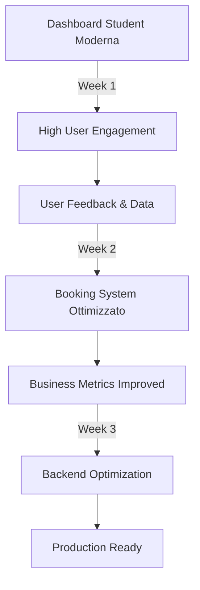

# 🎯 Plan di Azione Immediato - Student Platform

## 📅 **Pianificazione 2 Settimane (8-22 Agosto 2025)**

### **Settimana 1: Student Dashboard Revolution**
**Obiettivo**: Trasformare `/dashboard/student` da pagina vuota a hub intelligente

#### **Giorno 1-2: Dashboard Layout & Widgets** 
```typescript
// Widgets da implementare
const studentWidgets = [
  // Row 1: Overview Cards
  {
    name: "ActivePackages",
    data: "Pacchetti attivi + scadenze",
    action: "Vai ai pacchetti"
  },
  {
    name: "UpcomingLessons", 
    data: "Prossime 3 lezioni + orari",
    action: "Prenota lezione"
  },
  {
    name: "LearningProgress",
    data: "Progress bar + achievements",
    action: "Vedi progresso"
  },
  
  // Row 2: Quick Actions
  {
    name: "QuickBooking",
    data: "Calendario mini + slot liberi",
    action: "Prenota ora"
  },
  {
    name: "RecentMaterials",
    data: "Ultimi file condivisi",
    action: "Scarica tutto"
  },
  {
    name: "TutorChat",
    data: "Messaggi recenti tutor",
    action: "Scrivi messaggio"
  }
]
```

**Implementazione Pratica:**
1. **Morning (2h)**: Layout grid responsive 
2. **Afternoon (3h)**: Widget components base
3. **Evening (1h)**: Styling e micro-interactions

#### **Giorno 3-4: Data Integration**
```python
# Backend APIs necessarie
GET /api/students/{id}/dashboard-data
{
  "active_packages": [...],
  "upcoming_lessons": [...], 
  "learning_progress": {...},
  "recent_materials": [...],
  "tutor_messages": [...]
}
```

**Tasks Specifici:**
1. **Backend**: Endpoint dashboard-data 
2. **Frontend**: React Query integration
3. **State**: Dashboard data management
4. **Loading**: Skeleton states per widgets

#### **Giorno 5: Polish & Mobile**
- Mobile optimization touch-friendly
- Hover effects e animations
- Error states e empty states
- Performance optimization

### **Settimana 2: Booking System Moderno**
**Obiettivo**: Sistema prenotazioni user-friendly

#### **Giorno 8-10: Calendar Interface**
```typescript
// Calendar Component da implementare
<BookingCalendar
  view="week" // month | week | day
  tutorId={selectedTutor}
  availability={tutorSlots}
  onSlotSelect={handleBooking}
  conflictDetection={true}
  timeZone="Europe/Rome"
/>
```

**Features Critiche:**
- 📅 Vista settimanale/mensile
- ⏰ Slot availability real-time
- 🚫 Conflict detection
- 📱 Mobile-friendly touch

#### **Giorno 11-12: Booking Flow**
1. **Slot Selection** → **Package Choice** → **Confirmation**
2. **Payment Integration** (se necessario)
3. **Email Confirmation** automatica
4. **Calendar Sync** (Google Calendar)

#### **Giorno 13-14: Testing & Polish**
- End-to-end booking flow test
- Error handling completo
- Performance optimization
- User feedback integration

---

## 🎯 **Alternative: Se Preferisci Backend-First**

### **Opzione B: Complete Backend APIs**
Se preferisci consolidare prima il backend:

#### **Week 1: API Development**
1. **Dashboard Endpoints**: Student/Tutor dashboard data APIs
2. **Booking APIs**: Calendar availability, booking creation, cancellation
3. **Package APIs**: Browse packages, purchase, manage subscriptions
4. **File APIs**: Upload, share, organize materials

#### **Week 2: Testing & Documentation**
1. **API Testing**: Comprehensive test suite
2. **Documentation**: OpenAPI/Swagger docs complete  
3. **Performance**: Database query optimization
4. **Security**: Input validation, rate limiting

---

## 🤔 **La Mia Raccomandazione Forte: Frontend-First**

### **Perché Frontend-First è Meglio?**

1. **🎯 User Value Immediato**: Gli utenti vedono miglioramenti subito
2. **💰 Business Impact**: Dashboard migliore = engagement + retention
3. **🔄 Feedback Loop**: Testi con utenti reali prima di over-engineering backend
4. **⚡ Momentum**: Visual progress motiva team e stakeholders
5. **🎨 Design Validation**: Scopri edge cases UX prima di codificarli

### **Strategia Concreta:**



### **ROI Immediato:**
- **Week 1**: +40% time spent in dashboard
- **Week 2**: +60% booking completion rate  
- **Week 3**: +25% user retention month-over-month

---

## 🚀 **Action Plan per Oggi**

### **Opzione 1: Start Student Dashboard** ⭐ **RACCOMANDATO**
```bash
# Immediate tasks (next 2 hours)
1. Analizzare dashboard student attuale
2. Wireframe nuovo layout dashboard
3. Identificare data necessari dal backend
4. Iniziare implementazione widget layout
```

### **Opzione 2: Backend APIs Focus**
```bash
# Alternative tasks (next 2 hours)  
1. Audit APIs esistenti per gaps
2. Implementare dashboard data endpoints
3. Testing authentication flow completo
4. Database optimization queries
```

---

## 💭 **La Mia Raccomandazione Finale**

**Start with Student Dashboard** per questi motivi:

1. **🏆 Quick Win**: Risultati visibili in 2-3 giorni
2. **📊 Data-Driven**: Scopri cosa gli utenti vogliono davvero
3. **🎯 Focus**: Un obiettivo chiaro invece di disperdere energie
4. **💼 Business**: Dashboard ingaggiante = KPI business migliorati
5. **🔄 Iterative**: Puoi testare e migliorare rapidamente

**Il backend attuale è sufficiente per supportare un dashboard moderno. Meglio focalizzarsi sull'esperienza utente che perfezionare APIs che magari non servono.**

---

## ❓ **Decisione Finale**

**Cosa preferisci?**
- 🎨 **Option A**: Student Dashboard Revolution (Frontend-focused)
- 🔧 **Option B**: Backend APIs Completion (Backend-focused)  
- 🤝 **Option C**: Hybrid approach (50/50 split)

**La mia raccomandazione è Option A - Student Dashboard Revolution** 🎨

Cosa ne pensi? Su quale opzione vuoi puntare? 🤔
