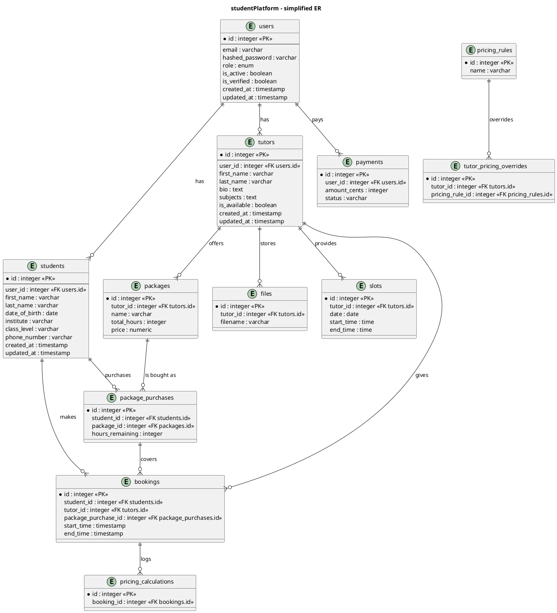

# Database schema reference (generated)

This document summarizes the current database models, Pydantic schemas, and key Alembic migrations for the backend. It was expanded to include concrete column types, NOT NULL / UNIQUE constraints, indexes and FK relationships for all main models.

Generated: 2025-08-28

---

## Tables & SQLAlchemy models (dettagliati)

Below are the models as declared in `backend/app/*/models.py` with column types and constraints mapped from SQLAlchemy declarations.

### users (Model: `User`)
- Table name: `users`
- Columns:
  - `id` : Integer, primary key, indexed
  - `email` : String, unique, indexed, NOT NULL
  - `hashed_password` : String, NOT NULL
  - `role` : Enum(UserRole) {`student`,`tutor`,`admin`}, NOT NULL
  - `is_active` : Boolean, default TRUE
  - `is_verified` : Boolean, default FALSE
  - `created_at` : DateTime, default now (UTC)
  - `updated_at` : DateTime, default now, onupdate now
- Relationships:
  - `student_profile` -> `students` (one-to-one, users.id = students.user_id)
  - `tutor_profile` -> `tutors` (one-to-one, users.id = tutors.user_id)
  - `sessions` -> `user_sessions` (one-to-many)
  - `password_resets` -> `password_resets` (one-to-many)

### students (Model: `Student`)
- Table name: `students`
- Columns:
  - `id` : Integer, primary key, indexed
  - `user_id` : Integer, ForeignKey(`users.id`), UNIQUE, NOT NULL, (indexed via FK)
  - `first_name` : String, NOT NULL
  - `last_name` : String, NOT NULL
  - `date_of_birth` : Date, NOT NULL
  - `institute` : String, NOT NULL
  - `class_level` : String, NOT NULL
  - `phone_number` : String, NOT NULL
  - `created_at` : DateTime, default now (UTC)
  - `updated_at` : DateTime, default now, onupdate now
- Relationships:
  - `user` -> `users` (many-to-one)
  - `bookings` -> `bookings` (one-to-many)
  - `package_purchases` -> `package_purchases` (one-to-many)

> Note: `address` column was removed from `students` (no longer present in model or schemas).

### tutors (Model: `Tutor`)
- Table name: `tutors`
- Columns:
  - `id` : Integer, primary key, indexed
  - `user_id` : Integer, ForeignKey(`users.id`), UNIQUE, NOT NULL
  - `first_name` : String, NOT NULL
  - `last_name` : String, NOT NULL
  - `bio` : Text, NULLABLE
  - `subjects` : Text, NULLABLE (stored as text / JSON string)
  - `is_available` : Boolean, default TRUE
  - `created_at` : DateTime, default now (UTC)
  - `updated_at` : DateTime, default now, onupdate now
- Relationships:
  - `user` -> `users` (many-to-one)
  - `bookings` -> `bookings` (one-to-many)
  - `packages` -> `packages` (one-to-many)
  - `files` -> `files` (one-to-many)
  - `slots` -> `slots` (one-to-many)

> Note: `hourly_rate` was removed from the `tutors` model and DB; pricing is handled via `packages` / `pricing_rules` and admin interfaces.

### user_sessions (Model: `UserSession`)
- Table name: `user_sessions`
- Columns:
  - `id` : Integer, primary key, indexed
  - `user_id` : Integer, ForeignKey(`users.id`), NOT NULL
  - `refresh_token` : String, NOT NULL
  - `expires_at` : DateTime, NOT NULL
  - `created_at` : DateTime, default now (UTC)

### password_resets (Model: `PasswordReset`)
- Table name: `password_resets`
- Columns:
  - `id` : Integer, primary key, indexed
  - `user_id` : Integer, ForeignKey(`users.id`), NOT NULL
  - `token` : String, NOT NULL
  - `expires_at` : DateTime, NOT NULL
  - `used` : Boolean, default FALSE
  - `created_at` : DateTime, default now (UTC)

---

### packages (Model: `Package`)
- Table name: `packages`
- Columns:
  - `id` : Integer, primary key, indexed
  - `tutor_id` : Integer, ForeignKey(`tutors.id`), NOT NULL
  - `name` : String, NOT NULL
  - `description` : Text, NULLABLE
  - `total_hours` : Integer, NOT NULL
  - `price` : Numeric(10,2), NOT NULL
  - `subject` : String, NOT NULL
  - `is_active` : Boolean, default TRUE
  - `created_at` : DateTime, default now
  - `updated_at` : DateTime, default now, onupdate now
- Relationships:
  - `tutor` -> `tutors`
  - `purchases` -> `package_purchases`
  - `links` -> `package_resource_links`

### package_purchases (Model: `PackagePurchase`)
- Table name: `package_purchases`
- Columns:
  - `id` : Integer, primary key, indexed
  - `student_id` : Integer, ForeignKey(`students.id`), NOT NULL
  - `package_id` : Integer, ForeignKey(`packages.id`), NOT NULL
  - `purchase_date` : DateTime, default now
  - `expiry_date` : Date, NOT NULL
  - `hours_used` : Integer, default 0
  - `hours_remaining` : Integer, NOT NULL
  - `is_active` : Boolean, default TRUE
  - `created_at` : DateTime, default now
  - `updated_at` : DateTime, default now, onupdate now
- Relationships:
  - `student` -> `students`
  - `package` -> `packages`
  - `bookings` -> `bookings`

### package_resource_links (Model: `PackageResourceLink`)
- Table name: `package_resource_links`
- Columns:
  - `id` : Integer, primary key, indexed
  - `package_id` : Integer, ForeignKey(`packages.id`), NOT NULL, indexed
  - `title` : String, NOT NULL
  - `url` : Text, NOT NULL
  - `provider` : String, NULLABLE
  - `is_public` : Boolean, default TRUE
  - `created_at` : DateTime, default now
  - `updated_at` : DateTime, default now, onupdate now

---

### bookings (Model: `Booking`)
- Table name: `bookings`
- Columns:
  - `id` : Integer, primary key, indexed
  - `student_id` : Integer, ForeignKey(`students.id`), NOT NULL
  - `tutor_id` : Integer, ForeignKey(`tutors.id`), NOT NULL
  - `package_purchase_id` : Integer, ForeignKey(`package_purchases.id`), NOT NULL
  - `start_time` : DateTime, NOT NULL
  - `end_time` : DateTime, NOT NULL
  - `duration_hours` : Integer, NOT NULL
  - `subject` : String, NOT NULL
  - `notes` : Text, NULLABLE
  - `status` : Enum(BookingStatus) {pending, confirmed, completed, cancelled}, default pending
  - `created_at` : DateTime, default now
  - `updated_at` : DateTime, default now, onupdate now

  - Pricing-related calculated columns (nullable, populated by service):
    - `calculated_duration` : Integer, NULLABLE
    - `calculated_price` : Numeric(10,2), NULLABLE
    - `tutor_earnings` : Numeric(10,2), NULLABLE
    - `platform_fee` : Numeric(10,2), NULLABLE
    - `pricing_rule_applied` : String(100), NULLABLE
    - `pricing_calculation_id` : Integer, ForeignKey(`pricing_calculations.id`), NULLABLE

- Relationships:
  - `student` -> `students`
  - `tutor` -> `tutors`
  - `package_purchase` -> `package_purchases`
  - `pricing_calculation` -> `pricing_calculations`

---

### files (Model: `File`)
- Table name: `files`
- Columns:
  - `id` : Integer, primary key, indexed
  - `tutor_id` : Integer, ForeignKey(`tutors.id`), NOT NULL
  - `filename` : String, NOT NULL
  - `original_filename` : String, NOT NULL
  - `file_path` : String, NOT NULL
  - `file_size` : Integer, NOT NULL (bytes)
  - `mime_type` : String, NOT NULL
  - `subject` : String, NOT NULL
  - `description` : Text, NULLABLE
  - `is_public` : Boolean, default FALSE
  - `created_at` : DateTime, default now
  - `updated_at` : DateTime, default now, onupdate now

---

### slots (Model: `Slot`)
- Table name: `slots`
- Columns:
  - `id` : Integer, primary key, indexed
  - `tutor_id` : Integer, ForeignKey(`tutors.id`), NOT NULL
  - `date` : Date, NOT NULL
  - `start_time` : Time, NOT NULL
  - `end_time` : Time, NOT NULL
  - `is_available` : Boolean, default TRUE
  - `created_at` : DateTime, default now
  - `updated_at` : DateTime, default now, onupdate now

---

### payments (Model: `Payment`)
- Table name: `payments`
- Columns:
  - `id` : Integer, primary key, indexed
  - `user_id` : Integer, ForeignKey(`users.id`), NOT NULL, indexed
  - `amount_cents` : Integer, NOT NULL
  - `currency` : String(3), NOT NULL, default 'EUR'
  - `status` : String(20), NOT NULL, default 'pending'
  - `provider` : String(50), NULLABLE
  - `description` : String(255), NULLABLE
  - `external_id` : String(100), NULLABLE, indexed
  - `created_at` : DateTime, default now
  - `updated_at` : DateTime, default now, onupdate now

---

### pricing (Models: `PricingRule`, `TutorPricingOverride`, `PricingCalculation`)

#### pricing_rules (Model: `PricingRule`)
- Table name: `pricing_rules`
- Columns:
  - `id` : Integer, primary key, indexed
  - `name` : String(100), NOT NULL, UNIQUE
  - `lesson_type` : Enum(LessonType), NOT NULL
  - `subject` : String(50), NOT NULL
  - `min_duration` : Integer, default 1
  - `max_duration` : Integer, NULLABLE
  - `base_price_per_hour` : Numeric(10,2), NOT NULL
  - `tutor_percentage` : Numeric(5,4), default 0.7000
  - `volume_discounts` : JSON, NULLABLE
  - `is_active` : Boolean, default TRUE
  - `priority` : Integer, default 100
  - `description` : Text, NULLABLE
  - `created_at` : DateTime, default now
  - `updated_at` : DateTime, default now, onupdate now

#### tutor_pricing_overrides (Model: `TutorPricingOverride`)
- Table name: `tutor_pricing_overrides`
- Columns:
  - `id` : Integer, primary key, indexed
  - `tutor_id` : Integer, ForeignKey(`tutors.id`), NOT NULL, indexed
  - `pricing_rule_id` : Integer, ForeignKey(`pricing_rules.id`), NOT NULL, indexed
  - `custom_price_per_hour` : Numeric(10,2), NULLABLE
  - `custom_tutor_percentage` : Numeric(5,4), NULLABLE
  - `is_active` : Boolean, default TRUE
  - `valid_from` : DateTime, NULLABLE
  - `valid_until` : DateTime, NULLABLE
  - `notes` : Text, NULLABLE
  - `created_at` : DateTime, default now
  - `updated_at` : DateTime, default now, onupdate now

#### pricing_calculations (Model: `PricingCalculation`)
- Table name: `pricing_calculations`
- Columns:
  - `id` : Integer, primary key, indexed
  - `booking_id` : Integer, ForeignKey(`bookings.id`), NULLABLE, indexed
  - `lesson_type` : String(20), NOT NULL
  - `subject` : String(50), NOT NULL
  - `duration_hours` : Integer, NOT NULL
  - `tutor_id` : Integer, ForeignKey(`tutors.id`), NOT NULL
  - `applied_pricing_rule_id` : Integer, ForeignKey(`pricing_rules.id`), NULLABLE
  - `applied_override_id` : Integer, ForeignKey(`tutor_pricing_overrides.id`), NULLABLE
  - `base_price_per_hour` : Numeric(10,2), NOT NULL
  - `total_base_price` : Numeric(10,2), NOT NULL
  - `volume_discount_rate` : Numeric(5,4), default 0.0000
  - `final_total_price` : Numeric(10,2), NOT NULL
  - `tutor_earnings` : Numeric(10,2), NOT NULL
  - `platform_fee` : Numeric(10,2), NOT NULL
  - `tutor_percentage_applied` : Numeric(5,4), NOT NULL
  - `calculation_timestamp` : DateTime, default now
  - `calculation_notes` : Text, NULLABLE

---

## Pydantic schemas (high level)

Files: `app/users/schemas.py`, `app/auth/schemas.py`, `app/packages/schemas.py`, `app/bookings/schemas.py`, `app/pricing/schemas.py`, etc.

### User-related
- `UserBase` (email, role)
- `UserCreate` (email, password, role)
- `User` (response): id, email, role, is_active, is_verified, created_at, updated_at

### Student-related
- `StudentBase` (first_name, last_name, date_of_birth, institute, class_level, phone_number)
- `StudentCreate` (extends StudentBase with `user: UserCreate`)
- `Student` (response): StudentBase + id, user_id, created_at, updated_at
- `StudentWithUser` (Student + `user: User`)

### Tutor-related
- `TutorBase` (first_name, last_name, bio?, subjects?, is_available)
- `TutorCreate` (extends TutorBase with `user: UserCreate`)
- `TutorSelfCreate` (payload for current user to create tutor profile)
- `Tutor` (response): TutorBase + id, user_id, created_at, updated_at
- `TutorWithUser` (Tutor + `user: User`)

> Note: `hourly_rate` removed from creation/registration schemas and from model; admin pricing and rules live under `packages` and `pricing_rules`.

---

## Important migrations

Located in `backend/migrations/versions`

- `3367268e98a1_initial_migration.py` — initial schema (historical; originally included hourly_rate)
- `1388dfcd3a35_add_payments.py` — payments-related migration
- `add_pricing_system.py` — pricing system skeleton
- `eecdf9e451d1_extend_booking_with_pricing.py` — add booking pricing fields
- `remove_address_20250828_remove_address.py` — removes `address` from students
- `remove_hourly_rate_20250828.py` — removes `hourly_rate` from tutors table (applied)

---

## ER Diagram

Below are two renderable representations. The PlantUML block can be pasted into any PlantUML renderer; an ASCII fallback is included for quick viewing.

### PlantUML

### ASCII ER (compact)

users(id PK) 1---1 students(user_id FK)
users(id PK) 1---1 tutors(user_id FK)
students(id PK) 1---* package_purchases(student_id FK)  *---1 packages(id PK)
students(id PK) 1---* bookings(student_id FK)  *---1 tutors(id PK)
packages(id PK) 1---* package_resource_links(package_id FK)
bookings(id PK) *---1 package_purchases(id PK)
pricing_rules(id PK) 1---* tutor_pricing_overrides(pricing_rule_id FK)

---

## Notes and rationale

- `hourly_rate` was removed from the `tutors` model and related migration (`remove_hourly_rate_20250828.py`) drops the column. Pricing is managed through `packages` and `pricing_rules` + `tutor_pricing_overrides`.
- `address` was removed from `students` and the migration `remove_address_20250828_remove_address.py` has been applied.
- Several admin/analytics/notifications files currently contain placeholders (`TODO`) for models/schemas and are not included here as concrete tables; add them to this doc when implemented.

---

If you want, I can also:
- generate a PNG/SVG from the PlantUML block (requires PlantUML tooling or an online renderer), or
- open a PR with a small README section that documents how to keep this file up-to-date when adding models/migrations.

---
Updated: 2025-08-28
